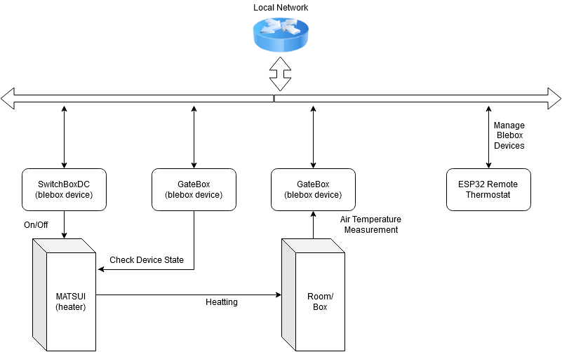
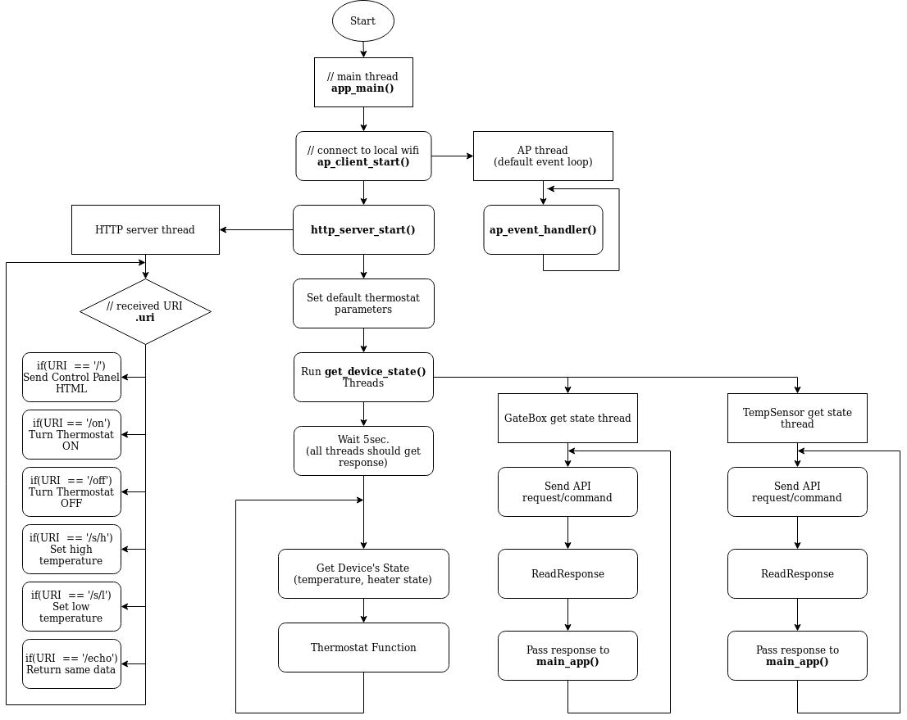

# ESP32 RemoteThermostat
Remote thermostat using blebox devices working on ESP32. 

## Autors
- Krystian Kasprów (226776) 
- Anita Grontman (226752)

## Project Description

Blebox tempSensor can be used as thermostat by it self, but it has no possibility (yet) to check device state, and work in conditional.
So for that kind of tasks, there is a need to use server, since blebox devices comunicate using url api commands.
The goal is, to create an embedded server working on ESP32 (idf), that can be a control unit handling remote thermostat task.
This can also be template for other more complicated tasks using blebox devices.

## Project info
- Software: Eclipse (with ESP32 Dev plugins) 
- Framework: ESP-IDF - Espressif IoT Development Framework
- Device system: FreeRTOS
- Programmer: RS323 Converter 
- Debugging tools: terminal + 3 stage logs (info, warning, error)  

## Responsibilities 
Anita Grontman: 
  - Project managment
  - Control panel (html)
  - Json parsing 
  
Krystian Kasprów: 
  - All things related to servers on RTOS
  - Debugging

## Network Diagram 

## Done 
- Start access point, connect to local wi-fi (handled by default event loop)
- Start new thread
- Send request url
- Get request response	
- Phrase response json 
- Multithreading 
- GateBox state read
- TempSensor state read
- SwitchBox command send
- Http server
- Html web page (control panel) send as http response 
- Pass data through control panel (browser) to device
- Thermostat function
- Found memory leak, fixed 
- Write thermostat parameters into flash memory (nonvolatile) 
- Dynamically allocated http requests
- All thermostat parametes are changable via POST requests

## TODO:
- Pass data through web page/control panel both directions (print device state)
- Add script to search for IP device 

## Comunication with thermostat (api)
Commands form http://<ip>/<command>
/on      - turn thermostat on
/off     - turn thermostat off
/s/h     - set high temperature treshold
/s/l     - set low temperature treshold
/period  - set main loop delay time 
/state   - get information

## Programm Diagram 

## Control panel (html page) 
If device has successfully connected to wifi and receives IP address,  
use browser and type IP address. You will see control panel of device.
  

