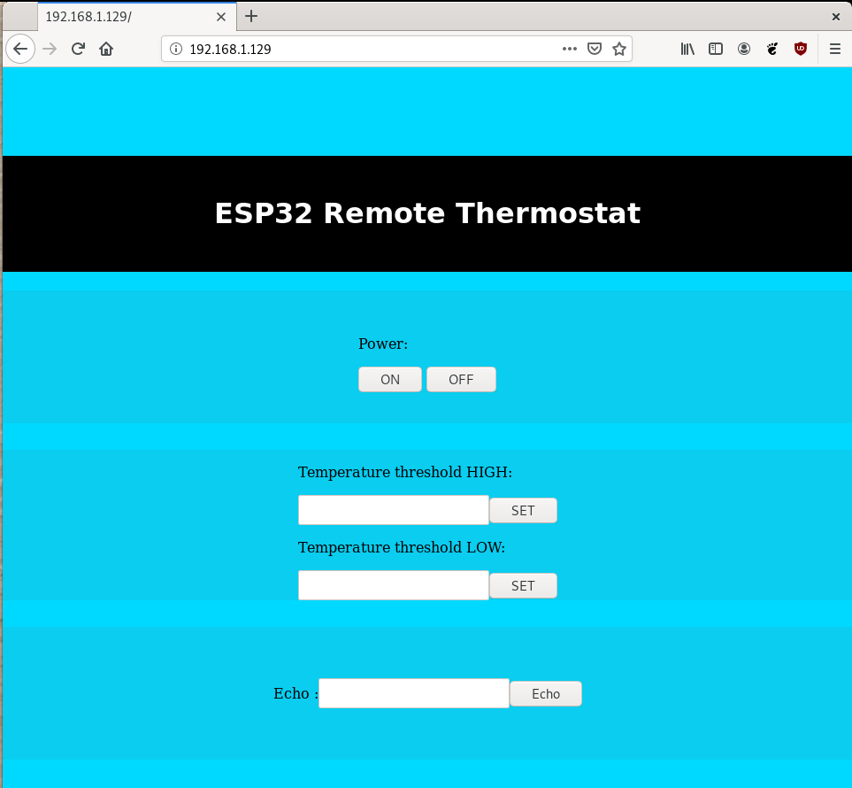

# ESP32 RemoteThermostat
Remote thermostat using blebox devices working on ESP32. 

## Autors
- Krystian Kasprów
- Anita Grontman

## Project Description

Blebox tempSensor can be used as thermostat by it self, but it has no possibility (yet) to check device state, and work in conditional.
So for that kind of tasks, there is a need to use server, since blebox devices comunicate using url api commands.
The goal is, to create an embedded server working on ESP32 (idf), that can be a control unit handling remote thermostat task.
This can also be template for other more complicated tasks using blebox devices.

## Project info
- Software: Eclipse (with ESP32 Dev plugins) 

## Done 
- Start access point, connect to local wi-fi (handled by default event loop)
- Start new thread
- Send request url 
- Get request response
- Phrase response json 
- Multithreading
- GateBox state read
- TempSensor state read
- SwitchBox command send
- http server
- html web page send as http response 

## TODO:
- pass data through web page
- create main thermostat function 

## Web page
If device has successfully connected to wifi and receives IP address,   type on any local device (connected to same local network):
 \<IP\>/hello 
  

